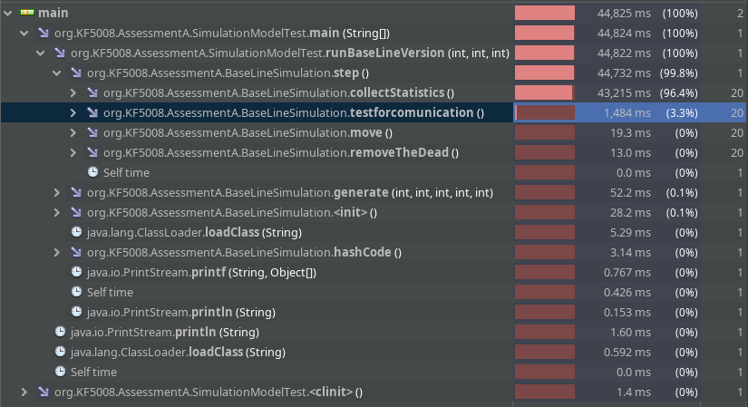

# Answers

## 3.1

>	[Oracle Treemap](https://docs.oracle.com/javase/8/docs/api/java/util/TreeMap.html)

## 3.2

### Description:

>	description

### TreeMap implements: 

-	NavigableMap <K, V>
-	Cloneable 
-	Serializable

### Navigable Map methods: 

-	ceilingEntry(K key)
-	ceilingKey(K key)
-	descendingKeySet()
-	descendinMap()
-	firstEntry()
-	floorEntry(K key)
-	floorKey(K key)
-	headMap(K toKey)
-	headMap()
-	higherEntry(K key)
-	higherKey(K key)
-	lastEntry()
-	lowerEntry(K key)
-	lowerKey(K key)
-	navigableKeySet()
-	pollFirstEntry()
-	pollLastEntry()
-	subMap(K fromKey, boolean fromInclusive, K toKey, boolean toInclusive)
-	subMap(K fromKey, K toKey)
-	tailMap(K fromKey)
-	tailmap(K fromKey, boolean inclusive)

\pagebreak

### TreeMap.containsKey():

>	This method searches for a key within the tree map so see if it
>	exists and returns a boolean.

>	The O notation for the method should be log(n). TreeMap is a
>	binary tree that stores key-value pairs sorted by the key.
>	Searching for if a key exists should be a binary search, which has
>	an O-notation of log(n);

## 4.1 TreeMap and HashMap:

### put():

The **put()** method takes a key-value pair, inserts it into the data
structure, be it HashMap or TreeMap. Both of them places them in a position
depending on the key. For HashMap, the key-value pair will be placed in an
internal array, where the index is based on the hash value of the key. Whereas
in TreeMap, the key-value pair is placed in a sorted position in a binary tree.

Hashmap's **put()** method has a better time complexity of O(1) when compared
to that of TreeMap's, which has a time complexity of O(log(n)). However, if the
overhead is considered, TreeMap could see less time taken when using **put()**.
Otherwise in the long run, Hashmap should take less time accessing it's values
using **put()**.

To achieve the time complexity of O(1), HashMap uses hashing to obtain the
index of it's internal array for the item. HashMap uses Java's own
**hashCode()** function to generate hashes based on the key.  The time
complexity of O(1) is dependant on the hash function's ability to produce a
completely different value with little change to the input value, in hopes to
reduce the number of collisions. 

// explain a hashing algorithm

An example of such hashing algorithm would be the MD5 algorithm.  Though
outdated and insecure for cryptographic purposes nowadays, it would still be
usefull for purposes similar to Java's HashMap. The algorithm would takes an
input spit into blocks of 512 bits, resulting in a fixed output that is 128
bits long. If the size of the input is not divisible by 512 bits, additional
padding would be required.

TreeMap is binary tree were the nodes are sorted by the key on the Key-Value
pairs. As **put()** takes in the key as the value, it would take a binary
search to find the key and it's corresponding value.  Whereas There is no
guarantee what order HashMap puts items. TreeMap's internal tree is also known
as a Red-black Tree.

// explain Red-black tree

A Red-black tree is a type of binary tree which is self balancing on insert. 

// conclusion

In conclusion, if order does not matter and all you need is pure lookup time in
a more substantial dataset, HashMap should be the choice of data structre.
However if sorting is required, and merging of two data sets needs to be done,
TreeMap could be the better option. A tree merging operation could be done in
O(log(n)), whereas a HashMap's merge operation would take O(n).

#### todo notes:
- Java HashMap uses hashCode().
- Explain hashing / tree balancing / red black tree.
- Explain usage (only accessing, or if you need sorting).
- Memory overhead of HashMap (most buckets/array slots aren't used).

### merge():

## 5.1


## 5.2
1.	StudentSimulation.collectstatistics()
2.	StudentSimulation.testforcommunication()
3.	StudentSimulation.move()
4.	StudentSimulation.removeTheDead()

## 5.3
1.	StudentSimulation.collectstatistics()
	- This Takes the most time and is the easiest to optimize with a time complexity of about O(n^3) with Linked List.
2.	StudentSimulation.testforcommunication()
	- This will ultimately take the most time to optimize.

## 5.4

1.	StudentSimulation.collectstatistics()
	- O(n3) with Linked List.

2.	StudentSimulation.testforcommunication()
	- O(n2).

## 5.5

O(n^2)

## 5.6

1.	StudentSimulation.move() - O(n).
2.	StudentSimulation.generate() - O(n).
3.	StudentSimulation.testforInfection() - O(n^2);

## 9.0

### 1. collectStatistics()

#### Original code:
```java
public void  collectStatistics( )
{ 
	List<MobilePhone>  uninfectedCount = new LinkedList< >( ) ; 
	List<MobilePhone>  infectedCount = new LinkedList< >( ) ; 
	double totalDist = 0 ;
	double unifectedDensity = 0 ; 
	double infectedDensity = 0 ; 
	double check ; 

	for( MobilePhone p: this.allPhones)
	{ 
		if( p.hasMessage( ) == false )// ADD TO THE FALSE LIST 
		{ 
			// only add to list if not added already in. 
			boolean found  = false ; 
			for( int a = 0 ; a < uninfectedCount.size() ; a++ )
			{ 
				MobilePhone  other = uninfectedCount.get(a);
				//check = Math.hypot(other.getHoz()-p.getHoz(), other.getVert()-p.getVert()); 
				if( p == other )   found = true;
			}
			if(found == false )
			{  
				uninfectedCount.add(uninfectedCount.size( ) /2, p);
				// totalDist += Math.hypot( p.getVert()  , p.getHoz()  );

				for( int b = 0 ;  b <  infectedCount.size( ) ; b++)
				{ 
					MobilePhone  other =  infectedCount.get( b); 
					//check = Math.hypot(other.getHoz()-p.getHoz(), other.getVert()-p.getVert()); 
					if( other == p )
					{ 
						System.out.println("Illegal cross contamination"); 
						assert false ; 
					}
				}
			}
		}else 
		{ 
			// only add to list if not added already in. 
			boolean found  = false ; 
			for( int a = 0 ; a < infectedCount.size() ; a++ )
			{ 
				MobilePhone  other = infectedCount.get(a); 
				// check = Math.hypot(other.getHoz()-p.getHoz(), other.getVert()-p.getVert()); 
				if( p == other )   found = true;
			}
			if(found == false )
			{  
				infectedCount.add(infectedCount.size( ) /2, p);
				//infectedDensity += Math.hypot( p.getVert()  , p.getHoz()  );

				for( int b = 0 ;  b <  uninfectedCount.size( ) ; b++)
				{ 
					MobilePhone  other =  uninfectedCount.get( b); 
					if( other == p )
					{ 
						System.out.println("Illegal cross contamination"); 
						assert false ; 
					}
				}
			} 
		}// end if p.hasMessage( ) == false
	}
	communicatedGrowthData.add(  infectedCount.size( ) ); 
	if( false ) System.out.printf(" INFECTED %d UNiNFECTED %d density %g, %g \n", infectedCount.size( ),
			uninfectedCount.size() , 
			( totalDist/uninfectedCount.size() ) , 
			(infectedDensity/infectedCount.size( ))  );
	numberOfInfected = uninfectedCount.size();  
}
```

#### Changed code:
```java
public void  collectStatistics( )
{ 
	int uninfectedCount = 0;
	int infectedCount = 0;
	double totalDist = 0 ;
	double unifectedDensity = 0 ; 
	double infectedDensity = 0 ; 
	double check ; 

	for (MobilePhone p : this.allPhones) 
	{
		infectedCount += p.hasMessage()? 1 : 0;
		uninfectedCount += p.hasMessage()? 0 : 1;
	}
	communicatedGrowthData.add(  infectedCount ); 
	if( false ) System.out.printf(" INFECTED %d UNiNFECTED %d density %g, %g \n", infectedCount,
			uninfectedCount , 
			( totalDist/uninfectedCount ) , 
			(infectedDensity/infectedCount)  );
	numberOfInfected = uninfectedCount;  
}
```

#### Reason:

The purpose of ``collectStatistics`` is to the counting of the number of phone
which returned true, when it's ``hasMessage()`` method was called.

### 2. step()
```java
public void step()
{ 
	move(); 
	testforcomunication() ;
	collectStatistics( ) ;
	removeTheDead( ) ; 
}
```
```java
public void step()
{ 
	move(); 
	quadtree.construct(this.allPhones);
	testforcomunication() ;
	collectStatistics( ) ;
	removeTheDead( ) ; 
}
```
#### Reason:

Added line to construct quadtree for query every iteration.

### 3. testforcommunication()

#### Original code:
```java
public void  testforcomunication()
{ 
	for( int a = 0 ; a < allPhones.size() ; a++  )
	{ 
		MobilePhone p = allPhones.get(a); // 7756 

		for( int b = 0 ; b <  allPhones.size() ; b++  )
		{ 
			MobilePhone other = allPhones.get(b); // 36,597
			if( other == p )continue ; 
			if( p.isSperationLessThan( p.getHoz(), p.getVert() , 
						other.getHoz() , other.getVert() , p.getCommuncationRadius() ) )
			{ 
				p.communicate(other);
			}

			// assumes mathematical knowlege... to speed up... unfair unless I show them. 
			/* double dist =  Math.hypot( p.getVert() - other.getVert() , p.getHoz() - other.getHoz() ); 

			   if( dist <= p.getCommuncationRadius())
			   { 
			   p.communicate(other);
			   }
			 */ 
			/* if( other == p )continue ;
			   double squr = p.getCommuncationRadius() * p.getCommuncationRadius(); 
			   double v = p.getVert() - other.getVert() ; 
			   double h = p.getHoz() - other.getHoz() ; 
			   double d = ( v* v ) + ( h * h );
			   if(  d <=  squr )
			   { 
			   p.communicate(other);
			   }*/ 
		}
	}
}

```

#### Changed code:
```java
public void  testforcomunication()
{ 
	for (MobilePhone p : allPhones) {
		int x = p.getHoz(), y = p.getVert(), r = p.getCommuncationRadius();

		AABB searchBox = new AABB(x-r, y-r, x+r, y+r);
		ArrayList<MobilePhone> closePhones = quadtree.query(searchBox);
		for (MobilePhone other : closePhones) {
			if( p.isSperationLessThan( p.getHoz(), p.getVert() ,
						other.getHoz() , other.getVert() , p.getCommuncationRadius() ) )
			{
				p.communicate(other);
			}
		}
	}
} 
```

#### Reason:

This method is an O(n^2) problem. To reduce the number of checks for every
phone, a QuadTree implemenatation was used. Querying the quadtree returns a
smaller list of ``MobilePhones`` that may be close. They query takes in an AABB
box, and ignores all points in quadrants that do not intersect with the input
AABB.
